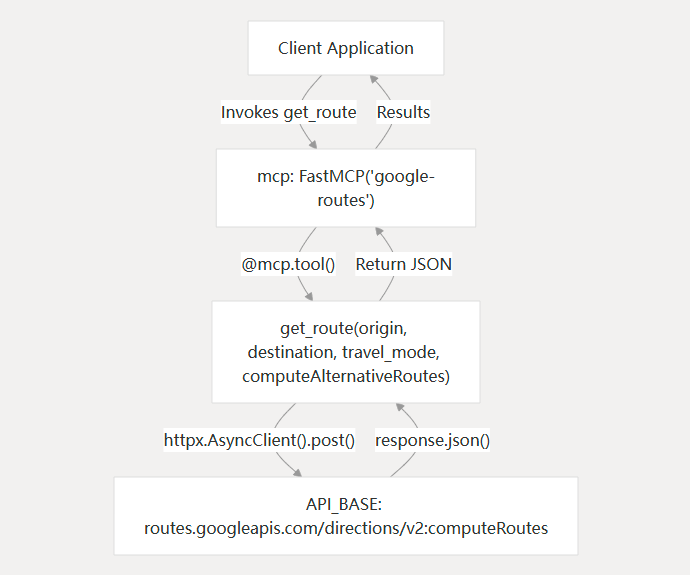

# Google Routes Python MCP

This project provides a Python-based implementation of a Model Context Protocol (MCP) server for interacting with the Google Routes API.

## Dependencies
- Python 3.11 or higher
- httpx
- mcp[cli]

## Virtual Environment Setup
1. Create a virtual environment:
   ```bash
   python -m venv venv
   ```
2. Activate the virtual environment:
    - On Windows:
      ```bash
      venv\Scripts\activate
      ```
    - On macOS/Linux:
      ```bash
      source venv/bin/activate
      ```
3. Install the required packages:
   ```bash
   pip install -r requirements.txt
   ```

## Diagram


## Service Initialization
The service initializes by creating a FastMCP instance and defining the Google API configuration:
 ```
mcp = FastMCP("google-routes", log_level="ERROR")

API_BASE = "https://routes.googleapis.com/directions/v2:computeRoutes"
CONTENT_TYPE = "application/json"
API_KEY = "YOUR_API_KEY"  # Replace with your actual API key
FIELD_MASK = "routes.legs,routes.duration,routes.distanceMeters,routes.polyline.encodedPolyline"
 ```
**Important**: Before using the service, replace the placeholder API key with a valid Google API key. [Google Maps Platform Documentation](https://developers.google.com/maps/documentation/routes/reference/rest)


## Docker Configuration
To build the Docker image:  
 1. Navigate to the root directory of the repository
 2. Run the following command:
    ```bash
    docker build -t google-routes-mcp .
    ```
3. Use Docker Desktop for easy management of the container.

## Test with VSCode Copilot
To use this project with VSCode Copilot, follow these steps:
1. Open the project in Visual Studio Code.
2. Ensure you have the Copilot extension installed and enabled.
3. Switch to the Copilot mode from "Ask/Edit" to "Agent"
4. Should be able to see a tool icon above the input box.
